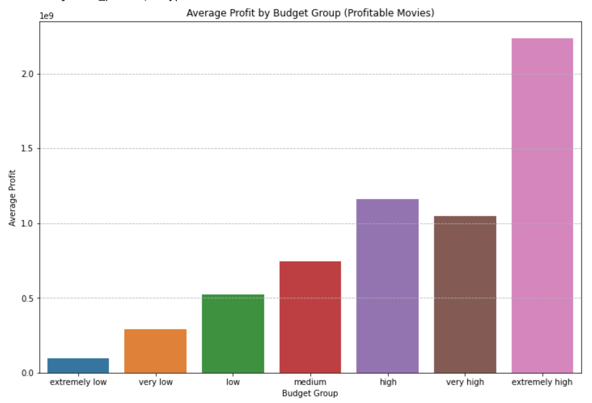

# Movie Analysis Project
**Author**: [Morgan Nash](mailto:morganmichellenash@gmail.com)

# Business Understanding

The purpose of this project is to answer questions about past films in order to give recommendations to our company, who is new to creating movies. By cleaning, organizing, and analyzing various data sets, the following questions are answered:

1. Which movie genres receive the highest ratings?
2. Is there a trend in the relationship between production budget and profit?
3. When is the best time of year to release a movie?
4. What studios make the most money?

# Data Understanding 
The data provided for this project comes from various sources and comes in different formats:

**Box Office Mojo** is primarily focused on tracking the financial performance of movies.
**IMDb** relies heavily on user ratings and calculates a weighted average rating for movies.
**Rotten Tomatoes** aggregates reviews from professional critics.
**The Movie Database** focuses on user ratings and community-driven content, similar to IMDb.
**The Numbers** focuses on the financial performance of movies, tracking box office gross, budgets, and profitability.

### Data Preparation & Analysis

### Visualizations & Findings

# Conclusions

## Limitations

## Recommendations

## Next Steps
